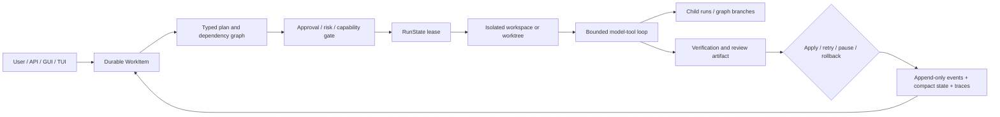

# Nexus AI expanded agent-loop research

Date: 2026-08-06
Scope: Hermes, OpenClaw, Agent Zero, Manus, Lemon AI/Lemonade, Genspark, Cursor, Devin, Replit AI, OpenCode, Codex, Flowcode/Flowise, Integravity/Antigravity, and additional comparable runtimes.

This report extends [LOOP_RESEARCH_REPORT.md](C:/Users/himan/Desktop/NEXUS%20AI/LOOP_RESEARCH_REPORT.md). It is research and architecture comparison; it does not claim that closed products expose internals that they do not publish.

## Executive conclusion

Nexus is not missing basic agent features. It already has a bounded model/tool loop, canonical events, planning, Hive sub-agents, provider fallback, memory/RAG, checkpoints, approvals, permissions, sandboxing, and GUI/TUI surfaces.

The gap exposed by this wider comparison is the product contract around work. The strongest systems make task identity, plan approval, isolated workspace, dependency state, pause/resume, review artifacts, rollback, and completion evidence first-class. Nexus has pieces of these capabilities, but they are not yet one authoritative durable state machine.

The most valuable direction is therefore a durable task/workflow control plane over the existing loop—not another intelligence layer.

## Source-confidence method

- **A** — official source repository, source file, API reference, or technical architecture documentation.
- **B** — official product documentation, help center, release note, or engineering announcement; implementation details may be private.
- **U** — product name or architecture could not be resolved from authoritative sources.

Feature claims are not benchmark claims. Closed products such as Manus, Genspark, Devin, Cursor, and Antigravity expose useful behavior and UX, but their internal planner, retry scheduler, and model router remain partly undisclosed.

## Systems covered

| System | Category | Public evidence | What is useful for Nexus |
|---|---|---:|---|
| Hermes Agent | local autonomous runtime | A/B | interruptible loop, strict message protocol, SQLite sessions, memory/skills split, isolated backends |
| OpenClaw | local personal-agent runtime | A | append-only event-tree sessions, persistent compaction, child-run recovery, per-agent policies |
| Agent Zero | Docker-first general agent | A/B | hierarchical delegation, project-scoped data, persistent context, intervention |
| OpenCode | open coding agent | A/B | resource-aware permissions, plan-mode restrictions, SQLite sessions, child sessions |
| Manus | cloud general agent | B | persistent virtual computer, browser/operator takeover, task API |
| Genspark | cloud multi-agent product | B | broad tools/models, specialized agents, save points; internals undisclosed |
| Lemon AI | open agent project | A/B | planning, browsing, code execution, monitoring; reliability claims unverified |
| Lemonade | local inference/agent desktop | A/B | multi-agent grid, workspaces, task lists, dangerous-mode visibility |
| Cursor | coding agent | A/B | remote background agents, branches, API, rules, high-concurrency task surface |
| Devin | cloud coding agent | A/B | assess→plan→approve→execute, confidence gating, takeover, session insights |
| Replit Agent | cloud IDE/agent | A | task board, dependencies, isolated copies, checkpoints, review/apply |
| Codex | local/cloud coding-agent product | A/B | composable skills/plugins/MCP/hooks, worktrees, permissions, local/cloud surfaces |
| Flowise | visual agent/workflow builder | A | graph-configured agents, tools, RAG, tracing, evaluations, HITL |
| Antigravity | agent-first development platform | B | manager surface, asynchronous agents, browser/terminal verification |
| OpenHands | open agent runtime | A | client/server sandbox, event+state persistence, pause/resume |
| SWE-agent | research coding agent | A | long-lived shell, history processor, task-specific ACI |
| Aider | terminal pair programmer | A/B | architect/code/ask/help modes, repo map, lint/test repair |
| PydanticAI | typed agent framework | A | graph iteration, durable execution adapters, typed outputs |
| AutoGen | multi-agent framework | A | explicit GraphFlow scheduling, filtering, barriers and review loops |
| CrewAI | crews/workflow framework | A | autonomous crews versus deterministic flows, persistence and guardrails |
| LangGraph | graph runtime | A | checkpoint/thread IDs, interrupt/resume, subgraph state |
| Semantic Kernel | enterprise agent framework | A | process orchestration and plan/execute separation |
| Goose | open local agent | A | transparent request→tool→observation loop and extension boundary |
| GitHub Copilot cloud agent | repository-native agent | A | branch/PR handoff, streaming status, CodeQL/secret scanning |

## 56 additional evidence-backed findings

### Loop, messages, and lifecycle

1. **Hermes has a documented conventional tool loop:** prompt, model call, tool execution, tool result, repeat, final answer. This is a strong baseline for Nexus’s direct loop. [Hermes agent loop](https://hermes-agent.nousresearch.com/docs/developer-guide/agent-loop/) — A.

2. **Hermes validates message-role alternation.** Preventing malformed user/assistant/tool sequences is a concrete protocol invariant Nexus should enforce centrally. [Hermes agent loop](https://hermes-agent.nousresearch.com/docs/developer-guide/agent-loop/) — A.

3. **Hermes makes model calls interruptible** and avoids persisting partial answers when the user stops or supersedes a run. Nexus should make cancellation terminal and turn-scoped. [Hermes agent loop](https://hermes-agent.nousresearch.com/docs/developer-guide/agent-loop/) — A.

4. **Hermes can execute independent tool calls concurrently while preserving result order**, while interactive tools remain sequential. Nexus should formalize the same safety distinction. [Hermes agent loop](https://hermes-agent.nousresearch.com/docs/developer-guide/agent-loop/) — A.

5. **OpenClaw separates reusable agent-core contracts from host runtime wiring.** Nexus’s mixin-heavy `NexusLoopV5` would benefit from a clearer core/runtime boundary. [OpenClaw runtime architecture](https://docs.openclaw.ai/agent-runtime-architecture) — A.

6. **OpenClaw stores mutable session metadata separately from append-only transcript events.** This is a better recovery model than treating one transcript file as the entire run state. [OpenClaw session management](https://docs.openclaw.ai/reference/session-management-compaction) — A.

7. **OpenClaw transcripts are tree-shaped, not only flat logs.** Parent IDs allow branching, summaries, and navigation; Nexus should consider branch IDs for replans and retries. [OpenClaw session management](https://docs.openclaw.ai/reference/session-management-compaction) — A.

8. **OpenClaw compaction is persistent and preserves tool-call/result pairs.** Nexus’s compactor should make protocol validity a hard postcondition. [OpenClaw compaction](https://docs.openclaw.ai/compaction) — A.

9. **OpenClaw can perform a memory-flush turn before compaction.** Durable memory capture should be an explicit phase rather than an accidental side effect of finalization. [OpenClaw compaction](https://docs.openclaw.ai/compaction) — A/B.

10. **OpenClaw has stale-run detection and bounded orphan recovery for child work.** Nexus Hive should persist child-run ownership and recovery state, not only lifecycle events. [OpenClaw subagents](https://docs.openclaw.ai/tools/subagents) — A.

11. **Agent Zero exposes a persistent context object with IDs, logs, pause state, task state, and output.** Nexus should make a comparable typed `RunState` reconstructible after restart. [Agent Zero source](https://raw.githubusercontent.com/agent0ai/agent-zero/main/agent.py) — A.

12. **Agent Zero supports intervention into a running agent** by propagating a new message into the current and superior agents. This is richer than a global abort flag. [Agent Zero source](https://raw.githubusercontent.com/agent0ai/agent-zero/main/agent.py) — A.

13. **Agent Zero surrounds initialization, prompting, model calls, streaming, and completion with hooks.** Nexus has hooks, but should document one authoritative lifecycle and hook error policy. [Agent Zero source](https://raw.githubusercontent.com/agent0ai/agent-zero/main/agent.py) — A.

14. **OpenCode treats primary agents and subagents as different configured roles.** Nexus should make delegation capability and tool visibility explicit per child role. [OpenCode agents](https://opencode.ai/docs/agents) — A/B.

15. **OpenCode’s permission rules match resources, not only tool names:** files, shell commands, URLs, MCP tools, skills, and subagent IDs can each be allowed, asked, or denied. [OpenCode permissions](https://opencode.ai/v2/docs/permissions) — A.

16. **OpenCode evaluates multi-resource operations conservatively:** one denied resource denies the operation; any ask-level resource requests approval. This is a useful policy rule for multi-file patches. [OpenCode permissions](https://opencode.ai/v2/docs/permissions) — A.

### Tasks, planning, and workspaces

17. **Replit turns a request into visible tasks with Draft, Active, Ready, and Done states.** Nexus should represent plan steps as durable work items, not only plan text. [Replit task system](https://docs.replit.com/core-concepts/agent/task-system) — A.

18. **Replit runs each task in an isolated project copy** and applies results to the main version only after review. Nexus should separate execution workspace from user workspace. [Replit task system](https://docs.replit.com/core-concepts/agent/task-system) — A.

19. **Replit supports task dependencies and queues dependent work.** Nexus Hive needs explicit dependency edges and completion predicates. [Replit task system](https://docs.replit.com/core-concepts/agent/task-system) — A.

20. **Replit exposes work logs, tests, and live previews before apply.** “Done” should mean reviewable evidence exists, not merely that the model stopped. [Replit task system](https://docs.replit.com/core-concepts/agent/task-system) — A.

21. **Replit checkpoints can include code, agent context, tasks, and connected database state.** Nexus workspace snapshots should be linked to task state and rollback semantics. [Replit checkpoints](https://docs.replit.com/references/version-control/checkpoints-and-rollbacks) — A.

22. **Devin separates repository assessment, detailed plan, approval, and autonomous execution.** Nexus should enforce planning as a phase boundary for high-risk work. [Devin interactive planning](https://docs.devin.ai/work-with-devin/interactive-planning) — A.

23. **Devin exposes shell, IDE, and browser surfaces during execution and supports takeover.** Nexus’s GUI should make intervention a first-class state transition. [Devin session tools](https://docs.devin.ai/work-with-devin/devin-session-tools) — A.

24. **Devin publishes confidence information and can gate on low confidence.** Nexus can combine model confidence, policy risk, verification evidence, and uncertainty into an approval decision. [Devin release notes](https://docs.devin.ai/release-notes/2025) — B.

25. **Cursor background agents use isolated remote machines, branches, and an API for create/monitor/follow-up.** Nexus needs a background task API with stable IDs and branch/workspace ownership. [Cursor background agents](https://docs.cursor.com/background-agent), [Cursor API](https://docs.cursor.com/background-agent/api/overview) — A.

26. **Cursor’s automatic terminal execution is explicitly a security tradeoff.** Autonomy should never silently imply unrestricted execution. [Cursor background agents](https://docs.cursor.com/background-agent) — A.

27. **Cursor’s foreground CLI supports resumable sessions, JSON output, approvals, and maximum turns.** These are straightforward contracts Nexus should expose consistently across GUI, TUI, and API. [Cursor CLI](https://docs.cursor.com/en/cli/using) — A.

28. **Manus operates a persistent virtual computer with internet, filesystem, software installation, and custom tools.** Nexus’s sandbox should be modeled as a durable workspace capability with explicit scope. [Manus welcome](https://manus.im/docs/introduction/welcome) — B.

29. **Manus supports browser and VS Code takeover when the agent needs human help.** Nexus should distinguish waiting-for-user from failed and preserve the exact continuation point. [Manus takeover](https://help.manus.im/en/articles/11711218-how-can-i-take-over-manus-browser-or-vs-code) — B.

30. **Manus exposes an API concept of agents, tasks, messages, and task management** while keeping the internal planner private. Nexus can match the public task contract without copying undocumented internals. [Manus API](https://open.manus.im/docs/v2/agents-overview) — A/B.

31. **Genspark claims specialized-agent coordination across many models, tools, and MCP integrations**, but publishes no inspectable scheduler or retry semantics. Nexus should treat this as a product-surface comparison, not source-level evidence. [Genspark Super Agent](https://www.genspark.ai/helpcenter?doc=general_What_is_Super_Agent) — B.

32. **Genspark’s “Save Points” are product persistence, not proof of durable execution.** Nexus should distinguish artifact save points from replay-safe state checkpoints. [Genspark AI Docs](https://www.genspark.ai/helpcenter/ai-docs) — B.

33. **Lemon AI and Lemonade are different projects.** Lemon AI is an agent platform; Lemonade is primarily a local inference server and multi-agent desktop surface. They must not share one comparison row. [Lemon AI](https://github.com/hexdocom/lemonai/releases), [Lemonade](https://github.com/lemonade-sdk/lemonade) — A/B.

34. **Lemonade exposes workspaces, task lists, browser nodes, and a multi-agent grid.** Nexus can borrow the UI pattern while keeping permissions centralized. [Lemonade docs](https://www.getlemonade.dev/docs) — A/B.

35. **Flowcode is unresolved as a general-purpose agent runtime.** The authoritative result found was an academic AI programming environment; “Flowise” is the likely intended visual-agent product. [Flowcode paper](https://arxiv.org/abs/2607.06721), [Flowise docs](https://docs.flowiseai.com/) — U/A.

36. **Flowise is graph-configured rather than one fixed autonomous loop.** It offers agents, tools, RAG, tracing, evaluations, and HITL, but behavior depends on the user-built graph. [Flowise docs](https://docs.flowiseai.com/) — A.

37. **Integravity could not be resolved as a canonical agent product.** “Antigravity” is likely intended; Nexus should preserve this uncertainty until the user supplies a URL or exact spelling. — U.

38. **Google Antigravity presents an editor view and manager surface for asynchronous multi-agent work** across editor, terminal, and browser, but does not publish its full scheduler or recovery protocol. [Google Antigravity](https://developers.googleblog.com/en/build-with-google-antigravity-our-new-agentic-development-platform/) — B.

### Context, durability, and orchestration

39. **OpenHands separates agent control from workspace execution through a client/server runtime.** Nexus should isolate execution backends from loop semantics. [OpenHands runtime architecture](https://docs.openhands.dev/openhands/usage/architecture/runtime) — A.

40. **OpenHands combines an event log with compact base state and validates tool compatibility on resume.** Nexus should reject or migrate resumes when the tool registry changes materially. [OpenHands persistence](https://docs.openhands.dev/sdk/guides/convo-persistence), [resume API](https://docs.openhands.dev/sdk/api-reference/openhands.sdk.agent) — A.

41. **SWE-agent keeps one long-lived shell session inside Docker for a task.** Workspace lifetime should be explicit and stable across model turns. [SWE-agent architecture](https://swe-agent.com/0.7/background/architecture/) — A.

42. **SWE-agent has a dedicated HistoryProcessor on every model call.** Nexus should make context selection/compaction a measurable policy subsystem, not only an emergency overflow path. [SWE-agent architecture](https://swe-agent.com/0.7/background/architecture/) — A.

43. **SWE-agent’s task-specific Agent-Computer Interface exposes safer higher-level commands.** Nexus can add `inspect_repo`, `apply_patch`, and `run_targeted_test` tools instead of relying on raw terminal commands for every task. [SWE-agent architecture](https://swe-agent.com/0.7/background/architecture/) — A.

44. **Aider separates architect, code, ask, and help modes** and supports repository mapping plus lint/test repair. Nexus should distinguish investigation, planning, implementation, and verification modes. [Aider docs](https://aider.chat/docs/) — A/B.

45. **PydanticAI exposes synchronous, asynchronous, streaming, event-streaming, and graph-node execution surfaces.** Nexus should make run modes consistent instead of allowing adapter-specific semantics. [PydanticAI agents](https://pydantic.dev/docs/ai/core-concepts/agent/) — A.

46. **PydanticAI supports durable execution through Temporal, DBOS, Prefect, and Restate integrations.** Nexus should define a durability adapter boundary independent of JSON/filesystem storage. [PydanticAI durable execution](https://pydantic.dev/docs/ai/capabilities/durable_execution/overview/) — A.

47. **AutoGen GraphFlow makes sequential, parallel, conditional, and looping execution explicit.** Nexus Hive should represent these as graph edges and barriers rather than only conversational delegation. [AutoGen GraphFlow](https://microsoft.github.io/autogen/stable/user-guide/agentchat-user-guide/graph-flow.html) — A.

48. **AutoGen supports message filtering and review loops.** Nexus should define per-agent context visibility and quorum/dependency conditions. [AutoGen GraphFlow](https://microsoft.github.io/autogen/stable/user-guide/agentchat-user-guide/graph-flow.html) — A.

49. **CrewAI distinguishes autonomous crews from deterministic flows** and documents persistence, guardrails, callbacks, and HITL triggers. Nexus should separate open-ended Hive from controlled workflows. [CrewAI docs](https://docs.crewai.com/) — A.

50. **LangGraph makes `thread_id`, checkpoints, interrupts, and explicit resume commands first-class.** This is the clearest model for Nexus approvals and blocked tasks. [LangGraph interrupts](https://docs.langchain.com/oss/python/langgraph/interrupts) — A.

51. **LangGraph warns that code before an interrupt can execute again after resume.** Nexus tools must carry idempotency keys or checkpoint-before-side-effect rules. [LangGraph interrupts](https://docs.langchain.com/oss/python/langgraph/interrupts) — A.

52. **Semantic Kernel separates agent abstractions from orchestration packages and emphasizes process workflows.** Nexus should keep providers/models independent from scheduling and planning. [Semantic Kernel orchestration](https://learn.microsoft.com/en-us/semantic-kernel/frameworks/agent/agent-orchestration/) — A.

53. **Goose exposes a transparent request→provider→tool call→extension→tool result→context revision loop** and converts malformed tool calls into model-visible observations. Nexus should show this same lifecycle in the GUI. [Goose architecture](https://goose-docs.ai/docs/goose-architecture/) — A.

54. **Codex’s documented architecture is composable across tools, skills, MCP, plugins, hooks, subagents, worktrees, and local/cloud environments.** Nexus has equivalent subsystems but needs clearer capability contracts and ownership. [Codex manual](https://developers.openai.com/codex/codex-manual.md) — A.

55. **GitHub Copilot’s normal delivery artifact is a branch and pull request with streamed progress and security checks.** Nexus should produce a structured review artifact before applying workspace changes. [GitHub Copilot agents](https://docs.github.com/en/copilot/how-tos/copilot-on-github/use-copilot-agents/overview) — A.

56. **Across the reviewed systems, the dominant product loop is inspect/contextualize → plan → execute in an isolated workspace → verify/review → apply or rollback.** This is a cross-source synthesis, not a claim that every vendor implements identical internals. [Cursor](https://docs.cursor.com/background-agent), [Devin](https://docs.devin.ai/work-with-devin/interactive-planning), [Replit](https://docs.replit.com/core-concepts/agent/task-system), [Codex](https://developers.openai.com/codex/codex-manual.md), [GitHub Copilot](https://docs.github.com/en/copilot/how-tos/copilot-on-github/use-copilot-agents/overview) — A-level synthesis.

## Nexus comparison: preserve versus improve

### Preserve

- Broad canonical event taxonomy and SSE replay surface.
- Local-first multi-provider support.
- Hive lifecycle tracking and parallel read-only executor.
- Approval broker, risk scoring, sandbox tiers, threat scanning, and workspace protection.
- Memory/RAG, tool-result archival, checkpoints, provider capability lookup, and verification events.

### Improve first

1. Create one durable `RunState`/`WorkItem` model linking task, plan, step, tool call, approval, verification, workspace, and terminal state.
2. Make task identity survive restart/reconnect and separate task state from chat transcript.
3. Add explicit states: `draft → planned → approved → running → waiting → ready_for_review → applied → failed/cancelled`.
4. Add per-run deadlines, cancellation tokens, and interruption semantics; remove reliance on mutable global flags.
5. Give each child agent a persistent child run, isolated context contract, workspace policy, and recovery status.
6. Add idempotency keys and checkpoint-before-side-effect rules to replayable tools.
7. Add bounded event queues with backpressure, deterministic sequence allocation, and reconnect tests.
8. Add typed provider/tool errors: timeout, auth, quota, malformed output, policy denial, cancellation, dependency, and unknown.
9. Make compaction protocol-aware and preserve assistant tool-call/result pairs; add a durable memory flush phase.
10. Add a review artifact containing files changed, commands, tests, security findings, failures, and evidence links before apply.
11. Separate autonomous Hive from deterministic graph workflows with explicit dependency edges and quorum barriers.
12. Add OpenTelemetry-compatible trace/span correlation while retaining canonical product events.

## Recommended benchmark and chaos suite

- Kill the process during model call, tool completion, event persistence, checkpoint write, approval wait, and finalization.
- Resume with changed tool registry, changed workspace, stale child run, and corrupt state file.
- Run two processes against one task and verify lease ownership.
- Replay recorded model/tool traces without repeating side effects.
- Apply a hanging provider, hanging registry tool, hanging MCP tool, and hanging subprocess; verify each deadline.
- Force compaction in the middle of tool-call/result pairs.
- Attach a slow SSE consumer and verify bounded memory and terminal-event delivery.
- Test approval disconnect/reconnect and timeout-to-deny behavior.
- Compare character estimates with actual provider token counts for code, JSON, Hindi, and tool output.
- Verify every security decision is attributable to one redacted policy record.

## Final architecture target

The target keeps Nexus’s local safety and event strengths while adding the durable task semantics demonstrated by Replit, OpenClaw, LangGraph, OpenHands, Codex, Cursor, and GitHub’s agent workflows.

## Unresolved names

- **Lemon AI**: treated as `hexdocom/lemonai`; **Lemonade** is separately treated as `lemonade-sdk/lemonade`.
- **Flowcode**: not resolved as a general agent runtime; **Flowise** is included as the likely intended visual-agent platform.
- **Integravity**: no authoritative canonical product was found; **Antigravity** is included as the likely intended product.

## Primary bibliography

[Hermes](https://hermes-agent.nousresearch.com/docs/), [OpenClaw](https://docs.openclaw.ai/), [Agent Zero](https://github.com/agent0ai/agent-zero), [OpenCode](https://opencode.ai/docs/), [Manus](https://manus.im/docs/introduction/welcome), [Genspark](https://www.genspark.ai/helpcenter?doc=general_What_is_Super_Agent), [Cursor](https://docs.cursor.com/background-agent), [Devin](https://docs.devin.ai/work-with-devin/interactive-planning), [Replit](https://docs.replit.com/core-concepts/agent/task-system), [Codex](https://developers.openai.com/codex/codex-manual.md), [Flowise](https://docs.flowiseai.com/), [Antigravity](https://developers.googleblog.com/en/build-with-google-antigravity-our-new-agentic-development-platform/), [OpenHands](https://docs.openhands.dev/openhands/usage/architecture/runtime), [SWE-agent](https://swe-agent.com/0.7/background/architecture/), [Aider](https://aider.chat/docs/), [PydanticAI](https://pydantic.dev/docs/ai/capabilities/durable_execution/overview/), [AutoGen](https://microsoft.github.io/autogen/stable/user-guide/agentchat-user-guide/graph-flow.html), [CrewAI](https://docs.crewai.com/), [LangGraph](https://docs.langchain.com/oss/python/langgraph/interrupts), [Semantic Kernel](https://learn.microsoft.com/en-us/semantic-kernel/frameworks/agent/agent-orchestration/), [Goose](https://goose-docs.ai/docs/goose-architecture/), [GitHub Copilot agents](https://docs.github.com/en/copilot/how-tos/copilot-on-github/use-copilot-agents/overview).
