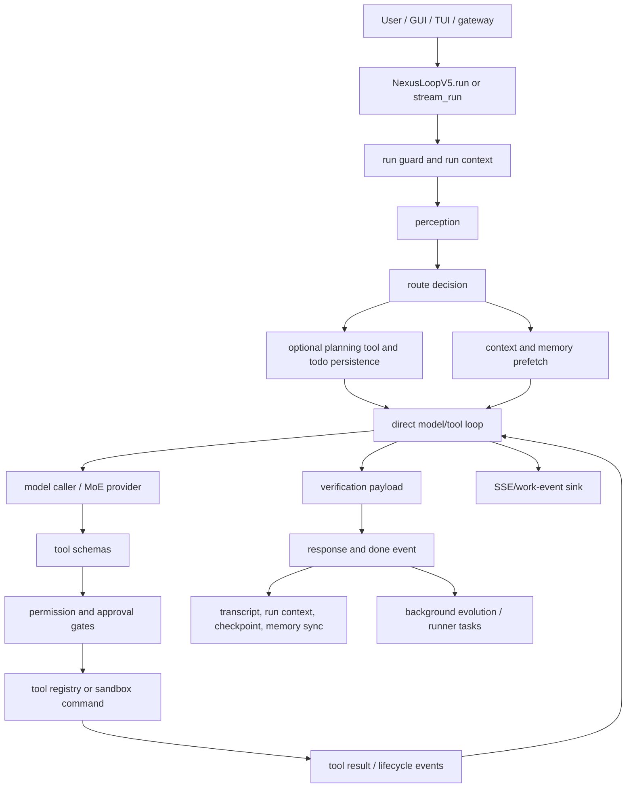

# Nexus AI loop research and improvement report

Date: 2026-08-06
Scope: `orchestrators/v5/`, connected tool/provider/context/checkpoint/server paths, and current primary documentation for comparable agent runtimes.

## Executive conclusion

Nexus has a serious foundation: a real model/tool loop, canonical lifecycle events, provider abstraction, registry-backed tools, permission checks, sandbox execution, checkpoints, context bounding, repair instructions, and V5 compatibility layers. The main weakness is not a lack of features; it is that too many partially overlapping features are composed through defensive fallbacks and compatibility mixins. That makes behavior difficult to reason about, adds latency, and allows capabilities to exist without a single authoritative state contract.

The first verified implementation defect found during this review was in the background priority runner. Its lazy storage methods overwrote their own method names, so the first priority submission could fail; its priority sort also used the task object as a dictionary key even though the map was keyed by task ID. These are fixed in `orchestrators/v5/background_runner.py`, with regression coverage in `tests/v5/test_v5_background_runner.py`.

The delegated audits independently confirmed the highest-risk clusters: duplicate memory prefetch, inline synchronous SSE persistence and unbounded queues, missing V5 tool deadlines, abort races, non-atomic transcript/checkpoint writes, incomplete checkpoint restoration, and several security bypasses around external MCP and unavailable permission state. Their evidence is incorporated below and in the remediation order.

## Architecture map

### Primary control flow

1. `NexusLoopV5.__init__` eagerly constructs a large multiple-inheritance composition and soft-fails individual layer construction.
2. `run()` or `stream_run()` takes a per-instance non-blocking run lock and delegates to `_turn_events()`.
3. `_turn_events()` resets transient stream state, restores supplied transcript context, creates a turn/run identity, persists the user message, emits `run.started`, performs perception and route selection, optionally persists a plan, prefetches context, and calls `_run_direct_model_tool_loop()`.
4. The direct loop sends a bounded prompt to the model, parses native/text tool calls, executes tools, persists assistant/tool boundaries, feeds results back, repairs failures, and eventually requests a no-tools finalization round.
5. The core builds verification state, transitions the lifecycle, persists the final answer, emits `run.completed` or `run.failed`, and yields a `done` event.
6. Memory and evolution work continue through background/finalization paths; checkpoints are written at state transitions.

## Comparison baseline

The comparison is capability-oriented, not a claim that one product is universally best. Current primary sources describe the following patterns:

| Capability | Nexus today | OpenAI Agents SDK | Claude Code | LangGraph | Main implication |
|---|---|---|---|---|---|
| Core loop | Custom V5 direct loop plus legacy mixins | Runner manages turns, tools, guardrails, handoffs, sessions | Main session plus explicit Agent subagents | Graph/state machine runtime | Nexus needs fewer overlapping authorities |
| Multi-agent | Hive and background workers exist | Agents-as-tools and handoffs | Typed subagents with independent tools/permissions | Subgraphs and graph nodes | Make delegation a first-class durable object |
| State | Runtime memory, transcript, checkpoints, todo/task variants | Sessions and run state | Session transcript plus project memory | Checkpointer keyed by thread ID | Canonical run/plan/task state is missing |
| Human approval | Permission broker and confirmation gates | Interruptions/approval and resumable `RunState` | Permission modes and hooks | Dynamic interrupts with persisted state | Nexus should persist approval interruptions |
| Durability | JSON run context/checkpoints and append-like transcript | Sessions and durable integrations | Append-oriented session/subagent transcripts | Checkpointed graph state | Atomic writes and resume semantics need strengthening |
| Observability | Canonical events, logs, SSE | Built-in traces/spans for turns/tools/handoffs/guardrails | Hooks and lifecycle transcripts | Stream events and checkpoint state | Add trace/span correlation and bounded event delivery |
| Context | Character/token heuristics, compaction, archives | Sessions/context management | Compaction and project memory | State checkpoint plus explicit graph state | Separate durable evidence from prompt projection |
| Tool safety | Registry, risk scorer, permissions, sandbox, approvals | Guardrails, approvals, tool execution controls | Permission modes/hooks/MCP restrictions | Application-defined nodes/interrupts | Unify policy decisions and audit outcomes |
| Parallelism | Separate parallel executor; direct path mostly serial | Configurable function-tool concurrency | Subagent parallelism | Graph branches/supersteps | Route safe read-only batches intentionally |

Primary references consulted:

- [OpenAI Agents SDK agents and runner](https://openai.github.io/openai-agents-python/agents/)
- [OpenAI Agents SDK orchestration](https://openai.github.io/openai-agents-python/multi_agent/)
- [OpenAI Agents SDK running agents, approvals, and tracing](https://openai.github.io/openai-agents-python/running_agents/)
- [OpenAI Agents SDK tracing](https://openai.github.io/openai-agents-python/tracing/)
- [Claude Code custom subagents](https://code.claude.com/docs/en/sub-agents)
- [Claude Code hooks](https://code.claude.com/docs/en/hooks)
- [Claude Code CLI permissions](https://docs.anthropic.com/en/docs/claude-code/cli-usage)
- [LangGraph interrupts and checkpointing](https://langchain-ai.github.io/langgraph/concepts/breakpoints/)

## Gap inventory: 50 concrete items

Severity: **P0** blocks correctness/safety; **P1** materially harms reliability or latency; **P2** reduces maintainability, observability, or product quality.

### Control plane and architecture

1. **P1 — Multiple inheritance has a very large MRO.** `NexusLoopV5` composes more than twenty mixins in `orchestrators/v5/core.py`; method ownership and override order are difficult to verify.
2. **P1 — Eager initialization soft-fails layers.** `_init_layers()` records `None` after construction errors, allowing degraded execution without a machine-readable capability health state.
3. **P1 — Compatibility stubs remain in the authority class.** `_save_checkpoint`, `_log_mission_replay`, `_start_background_finalization`, and evolution gap methods in `core.py` are stubs or aliases while similarly named mixins implement real behavior.
4. **P1 — PAORR and the direct loop coexist.** `_turn_events()` comments that the older PAORR path is unreachable after the direct-loop return, leaving two conceptual execution authorities.
5. **P1 — Planning adds a separate model decision before the direct loop.** Complex requests can pay for routing/perception/planning model work and then another model decision in the direct loop.
6. **P1 — No explicit capability contract is produced at startup.** The runtime does not expose one immutable report saying which planner, verifier, provider, memory, sandbox, and approval capabilities are active.
7. **P2 — Configuration is spread across runtime fields, environment, provider config, and mixin defaults.** There is no single validated run configuration snapshot.
8. **P2 — Feature flags are not centrally enforced.** `feature_reasoning`, `feature_planning`, `feature_evolution`, and related flags coexist with layer methods that can still be called directly.
9. **P1 — Per-session locking is process-local.** `_run_guard` prevents concurrent calls only on one object in one process; multiple server workers or processes can mutate the same session concurrently.
10. **P1 — Session identity is not a distributed lease.** Run IDs are persisted, but there is no atomic ownership/lease record to prevent two processes from claiming the same session.

### Lifecycle, cancellation, and failure semantics

11. **P1 — Abort state is loop-global.** `_abort_flag` is one event on the loop object, not a per-run cancellation token tied to a run ID.
12. **P1 — Cancellation does not guarantee tool-side cleanup.** A cancelled model turn can interrupt the orchestration while a subprocess, MCP request, or provider thread has its own cleanup semantics.
13. **P1 — Model timeout is fixed in call sites.** The direct loop uses a hard-coded 90-second model timeout instead of a policy derived from provider/model/turn budget.
14. **P1 — A full-turn deadline is not authoritative.** Individual model/tool timeouts exist, but there is no one deadline that bounds perception, planning, context, tool execution, finalization, and cleanup together.
15. **P1 — Error taxonomy is compressed.** Provider authentication, quota, timeout, malformed response, tool failure, policy denial, cancellation, and persistence failure often collapse into generic strings.
16. **P1 — Hook failures are debug-only.** `HookRegistry.trigger()` catches callback failures and logs at debug level, so an operator cannot tell whether governance hooks actually ran.
17. **P1 — Event sink latency is on the critical path.** `_emit_work_event()` awaits an async sink inline; a slow GUI/SSE consumer can delay tool and lifecycle progression.
18. **P1 — Event buffering has no explicit backpressure policy.** `_stream_events` is a list with no size cap, overflow policy, or per-subscriber queue isolation.
19. **P1 — Duplicate event delivery paths exist.** Events are appended to the stream queue and also delivered to the sink, but there is no sequence/ack contract for reconnecting consumers.
20. **P2 — State transition callbacks are not isolated from transition latency.** `_transition_to()` awaits callbacks before the loop continues, so an observer can stall execution.

### Durability and resume

21. **P1 — Checkpoint writes are not atomic.** `_checkpoint_save()` writes directly to the final JSON path; a crash can leave truncated JSON.
22. **P1 — Checkpoint failures are swallowed.** Callers generally continue after a failed checkpoint without marking the run as degraded or exposing persistence loss.
23. **P1 — Checkpoints are phase snapshots, not a complete event log.** They do not provide an idempotent replay ledger for every tool side effect.
24. **P1 — Resume is evidence injection, not deterministic continuation.** The model receives prior plan/actions/results, but the runtime does not resume a durable step state machine with explicit completed/unknown steps.
25. **P1 — Orphaned tool calls are represented as text.** An “UNKNOWN” tool observation is inserted into the transcript, but there is no durable side-effect reconciliation protocol.
26. **P1 — Session bus writes are not atomic.** `_write_session_bus()` serializes the whole memory list directly to the target file.
27. **P1 — Transcript persistence is synchronous and frequent.** User, assistant tool-call, every tool result, and final messages can each cause disk writes during a turn.
28. **P1 — Corrupt memory falls back to empty memory.** `load_memory()` sets memory to `[]` after a parse error, which can hide data loss and cause context amnesia.
29. **P2 — No retention/compaction policy exists for tool-result archives.** Large outputs are archived under `context_archive/tool-results` without a lifecycle/size budget in the loop.
30. **P2 — Checkpoint selection is timestamp/file based.** There is no monotonic sequence or integrity checksum to detect stale, reordered, or partially replaced snapshots.

### Context and model efficiency

31. **P1 — Prompt size estimation is heuristic.** `_bounded_model_messages()` uses character counts divided by four, which can be inaccurate across languages, JSON, code, and provider tokenizers.
32. **P1 — Context projection is not typed.** Session history, RAG, failure vaccines, knowledge, episodic, and procedural context are concatenated into one text block with no source priority or provenance envelope.
33. **P1 — Compaction is lossy without a durable summary contract.** Older messages can be dropped into a summary marker without preserving all tool-call/result invariants and citations.
34. **P1 — Tool schemas can be very large.** The default schema limit is effectively unlimited unless configured, increasing first-turn latency and prompt cost.
35. **P1 — Tool schema selection has no measured recall/latency budget.** Query-related ranking and transport caps are not evaluated against a tool-selection benchmark.
36. **P2 — Project context is cached for the loop lifetime.** External file changes can remain invisible until a new loop or explicit cache reset.
37. **P2 — Context archives are not content-addressed.** Repeated oversized results can create duplicate artifacts and consume disk unnecessarily.
38. **P2 — No context provenance is exposed to the verifier.** The verifier cannot distinguish user facts, tool evidence, memory recalls, and model-generated summaries structurally.
39. **P1 — Perception and planning context can duplicate direct-loop context.** The same task and project information may be paid for in multiple model prompts.
40. **P2 — No adaptive model/context budget controller exists.** Complexity, remaining deadline, provider capability, and tool count do not jointly determine prompt and model budgets.

### Tools, retries, and parallel execution

41. **P1 — Direct-loop tool batches are serial.** Even when a model emits multiple independent read-only calls, `direct_loop.py` executes them one at a time; the separate parallel executor is not the normal authority.
42. **P1 — Safe parallelism is not proven by dependency analysis.** The loop uses tool classification but does not construct a dependency graph from calls, paths, or outputs before deciding concurrency.
43. **P1 — Repair budget is global to the turn.** A failure in one tool consumes the same repair budget as a different unrelated failure, reducing recovery quality on multi-step work.
44. **P1 — Retry classification is mostly string-based.** `_is_unavailable_tool_error()` and provider-error checks depend on message patterns rather than typed result/error codes.
45. **P1 — There is no idempotency key propagated to every tool adapter.** The call ID is persisted, but adapters are not uniformly required to deduplicate side effects after reconnect/retry.
46. **P1 — Repeated side-effect detection is incomplete.** The repetition guard is strongest in the separate parallel executor; direct-loop retries rely on model instructions and action history.
47. **P2 — Tool result normalization is duplicated.** Registry, sandbox, MCP, text-call, and direct-loop paths each interpret success/error envelopes.
48. **P2 — Tool concurrency/cooldown policy is not surfaced in planning.** The planner can propose work that the registry later serializes or throttles without a cost estimate.
49. **P1 — Human approval is not a first-class resumable run state.** Approval waits have events and timeouts, but the entire run is not durably resumable from a pending approval record.
50. **P1 — Tool execution and verification are not transactionally linked.** A “done” tool event, action record, and verification payload are written by separate steps without a single commit boundary.

### Governance, security, and operations

51. **P1 — Trust boundaries are distributed across permissions, risk scoring, threat scanning, sandbox, hooks, and adapters.** There is no one policy decision record that explains the final allow/deny outcome.
52. **P1 — Governance failures are often fail-soft for telemetry.** Several security/compatibility paths catch broad exceptions and continue, making degraded protection difficult to detect.
53. **P1 — Provider raw diagnostics can still be difficult to classify.** Redaction exists for bearer-like text, but typed secret scanning and structured provider error envelopes should happen before persistence.
54. **P2 — MCP and plugin capabilities are not uniformly included in the same trust manifest.** The model/tool inventory can contain adapters with different lifecycle and permission semantics.
55. **P2 — No run-level cost/usage budget is enforced by the loop.** Usage is available in comparable SDKs, but Nexus does not stop or degrade based on token, latency, or spend budgets.
56. **P2 — No durable trace/span ID hierarchy is guaranteed across provider, tool, checkpoint, and event logs.** Run/turn IDs exist, but child operation IDs are not standardized across all adapters.
57. **P2 — There is no deterministic replay harness for a recorded model/tool trace.** Regression tests rely mainly on mocks and focused behavior tests.
58. **P2 — No benchmark suite measures success, time-to-first-token, tool-call accuracy, recovery, or token overhead across providers.
59. **P2 — No chaos tests cover provider timeout, process crash, malformed stream, sink backpressure, corrupt checkpoint, or concurrent session ownership.
60. **P2 — The loop does not publish a capability/degradation summary in the final result.** Users can receive a response without knowing that planning, memory, verification, or persistence degraded.

## Implemented in this review

### Background runner correctness and cleanup

Changed `orchestrators/v5/background_runner.py` to:

- use dedicated storage attributes instead of shadowing the lazy accessor methods;
- resolve priority metadata from the actual `task_id → task` map;
- remove task IDs, metadata, and lane membership when tasks finish.

Added `tests/v5/test_v5_background_runner.py`, covering priority ordering and cleanup after completion.

### Memory, durability, and authorization hardening

Also changed the live loop to:

- reuse the perception-phase `MemoryContext` in the acting phase instead of running the memory fan-out twice;
- atomically replace V5 checkpoint JSON using a flushed temporary file and `os.replace`;
- atomically replace session memory files under a per-loop write lock;
- fail closed when the V5 permission subsystem is unavailable for either registry tools or command execution.
- scrub project context before it enters the direct model prompt, using the existing context-manager scrubber instead of bypassing it.

Regression coverage was added in `tests/v5/test_v5_permission_fail_closed.py`; the V5 suite also covers the direct loop and persistence paths.

As a verification cleanup, `gateway/telegram_bot.py` now ignores the setup placeholder token instead of constructing the optional Telegram client during import. This removed the only two failures from the first full-suite run.

## Prioritized remediation roadmap

### P0/P1 next

1. Introduce a canonical `RunState`/`WorkItem` contract containing run, plan, step, tool-call, approval, verification, and persistence status.
2. Replace direct checkpoint/session writes with atomic append-or-replace writes plus integrity metadata.
3. Add a durable per-session lease for multi-process server deployments.
4. Make approval and cancellation resumable states, not only events.
5. Replace string error matching with typed `ToolCallResult`/provider error categories everywhere.
6. Add one run deadline and propagate remaining time to model, tool, approval, memory, and finalization operations.
7. Decouple event delivery from the critical path with bounded per-subscriber queues and sequence numbers.
8. Make the direct loop use dependency-aware parallel read batches with explicit idempotency keys.

### P2 platform improvements

9. Collapse the multiple-inheritance surface into an explicit coordinator with named services.
10. Build a token-aware context planner with provenance and source priorities.
11. Add trace/span correlation, usage accounting, cost/latency budgets, and a replayable trace fixture format.
12. Add chaos, benchmark, and provider conformance suites before claiming production-grade superiority.

## Verification status

- Background runner and permission hardening regressions: passed (`3 passed`).
- Full V5 suite: passed (`163 passed`, 45 warnings).
- Existing GUI/frontend work remains verified from the previous task: GUI build passed and GUI API tests passed.
- Full loop verification is still in progress; the 50+ inventory is complete, but the larger remediation roadmap is intentionally not claimed complete until the canonical state, atomic durability, and run-level control work is implemented and tested.
