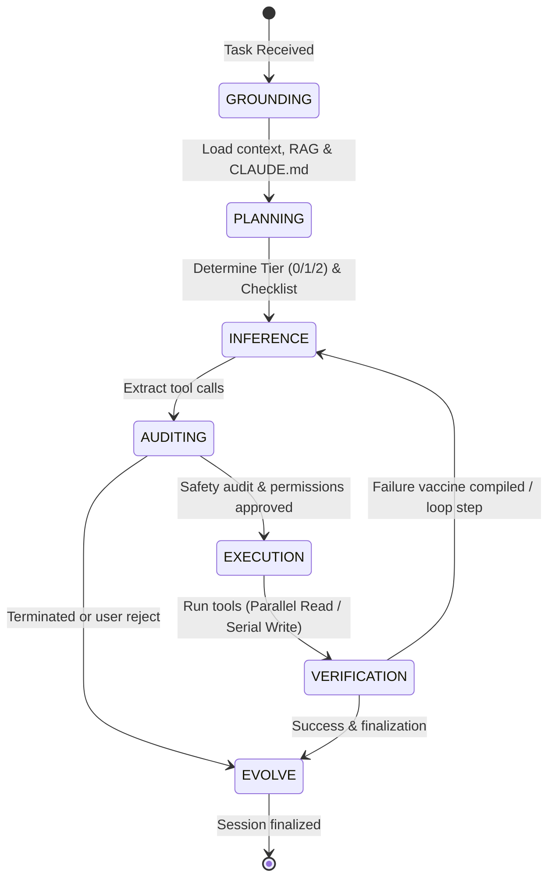

# NEXUS Unified Cognitive Loop (7-State Sovereign Architecture)

The `NexusLoop` (`orchestrators/loop.py`) is the core reasoning and execution runtime of NEXUS AI. It is implemented as an asynchronous, event-driven state machine coordinating context, dynamic sandboxing, customizable lifecycle hooks, permission policies, and automated self-evolution.

---

## State Machine Architecture

The engine cycles through seven distinct execution states (`SCAState`) during a turn:



### 1. Grounding (`SCAState.GROUNDING`)
Performs concurrent operations using `asyncio.gather` to minimize latency:
*   Loads progressive workspace rules (`CLAUDE.md`).
*   Retrieves relevant background knowledge via RAG index matches.
*   Performs structural compiler and target engine status checks.

### 2. Planning (`SCAState.PLANNING`)
An adaptive complexity classifier categorizes the task to scale reasoning overhead:
*   **Tier 0 (Direct Chat)**: Classifies simple conversational queries directly without checklist overhead.
*   **Tier 1 (Checklist)**: Uses a dynamic keyword scanner (detecting keywords like `search`, `edit`, `compile`, `test`, etc.) to build custom operational checklists tailored to the task description.
*   **Tier 2 (Roadmap Phases)**: Spawns the `NexusArchitect` planner to output a structured multi-phase milestone roadmap.

### 3. Inference (`SCAState.INFERENCE`)
Executes the LLM turn with pre/post-hook execution filters.
*   **User-Toggleable Thinking Mode**: Configures LLM inference to run step-by-step reasoning tokens (`thinking_mode=True`) or direct responses (`thinking_mode=False`).
*   Hooks triggered: `pre_llm_call`, `post_llm_call`.

### 4. Auditing (`SCAState.AUDITING`)
Calculates command risk scores and evaluates executions against one of four permission policies:
*   `AUTO`: Executes all tool operations automatically.
*   `AI_DECIDE`: Dynamically applies safety rules and risk scores.
*   `ASK_ALL`: Pauses execution for interactive user confirmation.
*   `CHECKLIST`: Runs whitelisted tools automatically, prompting only for others.

### 5. Execution (`SCAState.EXECUTION`)
Runs tool calls safely inside the container environment:
*   **Concurrency Separation**: Non-blocking concurrent execution of read-only tools via `asyncio.gather`, while write operations are executed sequentially to prevent state collisions.
*   **Sandboxing**: Dynamic sandbox selection (None / Normal Sandbox / Docker Container) scaled according to Command Risk scores.

### 6. Verification (`SCAState.VERIFICATION`)
Acts as a compiler and test execution gate:
*   **Context-Aware Failure Vaccines**: If a step fails, the compiler parses the observation logs, extracts specific error lines, and builds a targeted `CRITICAL PREVENTIVE VACCINE` instruction, adding it to the LLM context to prevent repeating the same mistake.
*   **Targeted Test Selection**: Utilizes git diffs to map modified files to tests using `TestSelector`, running only affected test cases automatically.

### 7. Evolution (`SCAState.EVOLVE`)
Consolidates training data and execution metrics:
*   Saves final message lists to `logs/sessions/<session_id>.json`.
*   Records success/failure metrics to the ledger via `evolution_log`.

---

## Memory & Platform Cohesion

To support integration with the Live Operator Shell, command-line interfaces, and the Gateway server, the state machine implements:
*   `save_memory()`: Auto-persists conversation history immediately to JSON files.
*   `load_memory(session_id)`: Loads conversation history from session-specific cache.
*   `sync_memory()`: Performs a high-performance sync of session memories to maintain consistency between separate processes (e.g. terminal and GUI panels).

---

## Testing & Verification

To verify state transitions, configuration parameters, and dynamic compilers, execute:
```powershell
python -m pytest tests/ -v --tb=short
```
All tests verify parallel grounding, dynamic planning, hook callbacks, and context-aware failure vaccine generation.
