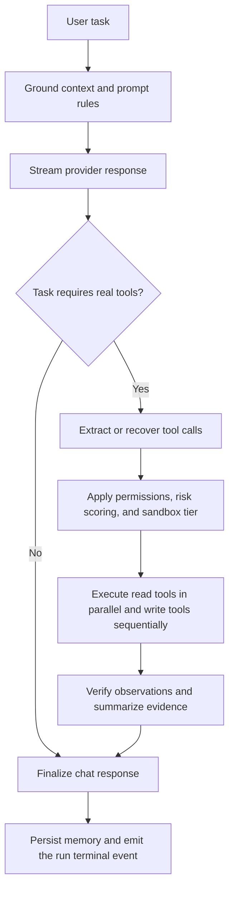

# NEXUS Unified Cognitive Loop

The V5 `NexusLoop` (`src/nexus/main_agent/core.py`) is the NEXUS runtime harness. The TUI/GUI backend, standalone server, Rich shell, gateways, and hive tools all enter this contract. It coordinates request-scoped provider selection, context, permissions, command risk scoring, sandbox routing, tool execution, verification, memory persistence, cancellation, and canonical work events.

---

## Runtime Flow

The removed `SCAState` enum is no longer the runtime contract. A turn now follows one continuous loop with explicit lifecycle events:


```mermaid
flowchart TD
    A[User task] --> B[Ground context and prompt rules]
    B --> C[Stream provider response]
    C --> D{Task requires real tools?}
    D -- No --> I[Finalize chat response]
    D -- Yes --> E[Extract or recover tool calls]
    E --> F[Apply permissions, risk scoring, and sandbox tier]
    F --> G[Execute read tools in parallel and write tools sequentially]
    G --> H[Verify observations and summarize evidence]
    H --> I
    I --> J[Persist memory and emit the run terminal event]
```

### 1. Grounding
Performs concurrent operations using `asyncio.gather` to minimize latency:
*   Loads progressive workspace rules (`docs/NEXUS.md`).
*   Retrieves relevant background knowledge via RAG index matches.
*   Performs structural compiler and target engine status checks.

### 2. Planning
Action requests may reuse `todo.md` or create a plan through the registered `planning` tool. The legacy `architect.py` module was removed and is not the normal `NexusLoop.stream_run()` path.

### 3. Inference
Executes the LLM turn with pre/post-hook execution filters.
*   **User-Toggleable Thinking Mode**: Configures LLM inference to run step-by-step reasoning tokens (`thinking_mode=True`) or direct responses (`thinking_mode=False`).
*   **Request-Scoped Routing**: API provider, model, and token limits are forwarded for the current run without mutating another session's router defaults.
*   **Safe Response Classification**: Model text is accumulated before tool extraction so tool protocol is never rendered as a successful user response. Provider and tool work events still stream while they run.
*   **Stable Tool Call Identity**: Tool calls normalize tool names, wrap non-object arguments, and derive deterministic fallback call IDs when a provider omits one.
*   Hooks triggered: `pre_llm_call`, `post_llm_call`.

### 4. Auditing
Calculates command risk scores and evaluates executions against one of four permission policies:
*   `AUTO`: Executes all tool operations automatically.
*   `AI_DECIDE`: Dynamically applies safety rules and risk scores.
*   `ASK_ALL`: Pauses execution for interactive user confirmation.
*   `CHECKLIST`: Runs whitelisted tools automatically, prompting only for others.

### 5. Execution
Runs tool calls through the registry or the direct sandbox command path:
*   **Concurrency Separation**: Non-blocking concurrent execution of read-only tools via `asyncio.gather`, while write operations are executed sequentially to prevent state collisions.
*   **Sandboxing**: Dynamic sandbox selection (`normal` default, with explicit `no_sandbox` and `docker` tiers) scaled according to command risk scores.
*   **Balanced Lifecycle**: Every tool step emits started plus completed/failed events, with one terminal tool error.

### 6. Verification
Acts as a compiler and test execution gate:
*   **Context-Aware Failure Vaccines**: If a step fails, the compiler parses the observation logs, extracts specific error lines, and builds a targeted `CRITICAL PREVENTIVE VACCINE` instruction, adding it to the LLM context to prevent repeating the same mistake.
*   **Targeted Test Selection**: Utilizes git diffs to map modified files to tests using `TestSelector`, running only affected test cases automatically.

### 7. Finalization
Consolidates training data and execution metrics:
*   Saves final message lists to `.nexus/logs/sessions/<session_id>.json`.
*   Persists run identity and terminal status to `.nexus/logs/run_contexts/<session_id>/<run_id>.json`.
*   Records success/failure metrics to the ledger via `evolution_log`.
*   Emits `run.completed`, `run.failed`, or `run.cancelled` as the final run lifecycle record.

---

## Harness Ownership

* One session-owned `NexusLoop` accepts one active run at a time. A concurrent run is rejected instead of overwriting its turn ID, abort signal, memory, or event sink.
* Each `stream_run()` creates a durable run context with run/session IDs, provider, model, token limit, start time, terminal status, and a short prompt preview. The GUI backend can list these runs and replay their public work events; safe mid-run resume, branch, and export still belong above it.
* `abort()` is checked during provider streaming as well as between turns. Task cancellation closes both the message and run lifecycle.
* Provider fallback is allowed only before any answer text is emitted. A provider failure after partial output terminates that response instead of joining two providers' answers.
* Runtime context is bound to a tool only after its registry concurrency gate is acquired. Hive model calls run off the event loop and owned hive tasks have bounded consolidation and cancellation cleanup.
* Chat-only explanatory text is never parsed as an executable tool call. Only requests classified as requiring real tools enter auditing and execution.

---

## Memory & Platform Cohesion

To support integration with the Ink TUI, GUI, legacy Rich shell, and Gateway server, the loop implements:
*   `save_memory()`: Auto-persists conversation history immediately to JSON files.
*   `load_memory(session_id)`: Loads conversation history from session-specific cache.
*   `sync_memory()`: Performs a high-performance sync of session memories to maintain consistency between separate processes (for example TUI and GUI panels).

---

## Testing & Verification

To verify loop behavior, configuration parameters, tool parsing, event lifecycles, and dynamic compilers, execute:
```powershell
python -m pytest tests/ -v --tb=short
```
Focused loop tests live under `tests/v5/` and `tests/core/` (`test_runtime.py`, `test_task_workflow.py`, `test_approval_broker.py`, `core/test_evolution/`) and cover run ownership, cancellation, lifecycle balance, tool parsing, permission blocking, command failures, public work-event chunks, finalizer draining, and verified fallback summaries. Provider, gateway, hive, registry, and server harness tests live in their corresponding `tests/test_main/`, `tests/test_gateway_runtime.py`, `tests/test_tool_registry/`, and `tests/test_server/` modules.
