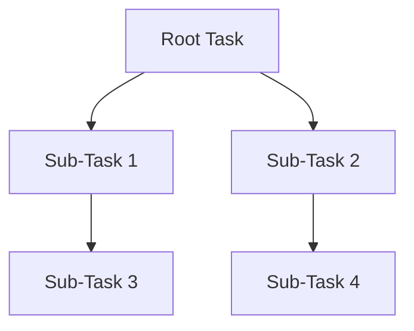
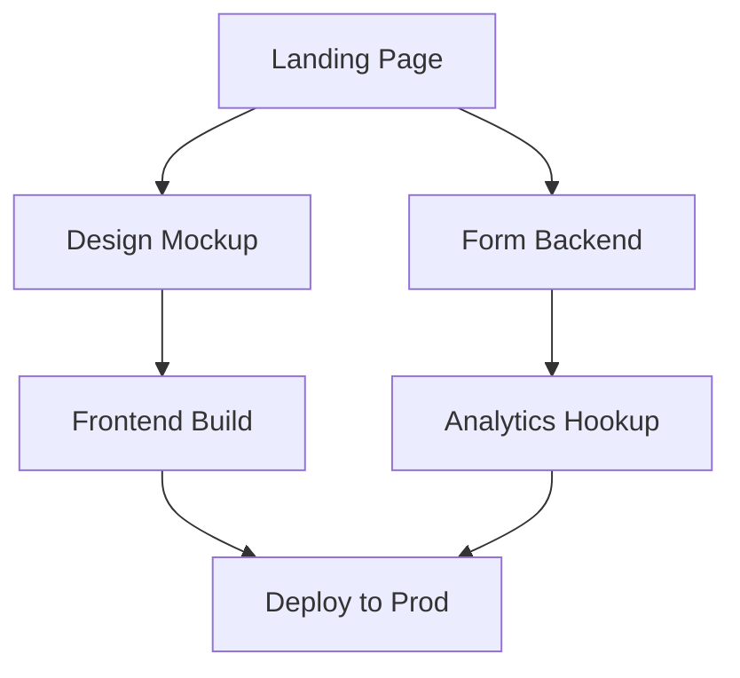

# Task Splitting Response Format

## Purpose

Standard template for breaking down complex tasks into concrete, sequential, and parallel-tracked sub-tasks. Used whenever a task requires decomposition before execution.

## Format Specification

```
# Task Split: <Original Task Title>

## Context
- **Original task:** <full description>
- **Split reason:** <why decomposition is needed e.g., complexity, multiple domains, long duration>
- **Success criteria:** <how we know the whole task is done>

## Task Graph



> *Diagram must show dependencies. Lines = dependency (upstream must finish first).*
> *Siblings with no connecting line = runnable in parallel.*

## Sub-Tasks (ordered by dependency DAG / topological order)

### Sub-Task 1 — <name>
- **Type:** sequential | parallel | blocker
- **Dependencies:** (none | Sub-Task X)
- **Estimated effort:** S | M | L | XL
- **Description:** <what, why, acceptance criteria>
- **Acceptance criteria:**
  - [ ] <checkable condition 1>
  - [ ] <checkable condition 2>

### Sub-Task 2 — <name>
- ...

## Parallel Execution Plan (optional)
| Wave | Runs in parallel            | Backlog    |
|------|-----------------------------|------------|
| 1    | Sub-Task 2, Sub-Task 3      | Sub-Task 4 |
| 2    | Sub-Task 4                  | —          |

## Risks & Mitigations
| Risk | Impact | Mitigation |
|------|--------|------------|
| <risk> | <high/med/low> | <action> |

## Status Tracking
| Sub-Task | Status       | Owner   | Notes |
|----------|--------------|---------|-------|
| 1        | pending       | —       |       |
| 2        | in-progress   | —       |       |

## Wrap-up / Merge Protocol
- **Merge owner:** <who reassembles results>
- **Merge steps:**
  1. Collect results of all sub-tasks.
  2. Verify against original success criteria.
  3. Run integration checks.
  4. Report final outcome + blockers.
```

## Field Conventions

| Field | Convention |
|-------|------------|
| Sub-task names | Imperative verb phrase (`Implement X`, `Fix Y`) |
| Status values | `pending`, `in-progress`, `blocked`, `done`, `cancelled` |
| Effort | S (<30min), M (1-2h), L (half-day), XL (full-day+) |
| Type | `sequential` (blocks downstream), `parallel` (independent), `blocker` (blocking others) |
| Acceptance criteria | Written as testable, boolean conditions starting with `[ ]` |

## Example Response

> **Task:** Ship a public landing page with form + analytics.

# Task Split: Landing Page Delivery

## Context
- **Original task:** Build and ship public landing page with signup form and analytics.
- **Split reason:** Cross-domain work (design, frontend, backend, infra).
- **Success criteria:** Live URL with working form submitting to DB and GA event fired.

## Task Graph



## Sub-Tasks

### Sub-Task 1 — Create design mockup
- **Type:** parallel
- **Dependencies:** none
- **Effort:** M
- **Description:** Produce Figma/HTML mockup.
- **Acceptance criteria:**
  - [ ] Mockup contains all 5 required sections
  - [ ] Approved by stakeholder

### Sub-Task 2 — Build form backend
- **Type:** parallel
- **Dependencies:** none
- **Effort:** S
- **Description:** POST endpoint storing submissions.
- **Acceptance criteria:**
  - [ ] POST /submit returns 201 and persists to DB

### Sub-Task 3 — Frontend build
- **Type:** sequential
- **Dependencies:** Sub-Task 1
- **Effort:** L
- **Description:** Implement responsive layout per mockup.
- **Acceptance criteria:**
  - [ ] Builds clean, renders at mobile+desktop

### Sub-Task 4 — Analytics hookup
- **Type:** sequential
- **Dependencies:** Sub-Task 2
- **Effort:** S
- **Description:** Fire GA event on form submit.
- **Acceptance criteria:**
  - [ ] Event visible in GA debugger

### Sub-Task 5 — Deploy to production
- **Type:** sequential
- **Dependencies:** Sub-Task 3, Sub-Task 4
- **Effort:** M
- **Description:** CI/CD + env config.
- **Acceptance criteria:**
  - [ ] Live URL serves latest build
  - [ ] Smoke test passes

## Parallel Execution Plan
| Wave | Runs in parallel | Backlog |
|------|------------------|---------|
| 1    | ST1, ST2         | ST3, ST4 |
| 2    | ST3, ST4         | ST5     |
| 3    | ST5              | —       |

## Risks & Mitigations
| Risk | Impact | Mitigation |
|------|--------|------------|
| Stakeholder late feedback | Medium | Schedule review early |
| DB schema drift | High | Lock schema before ST2 |

## Status Tracking
| Sub-Task | Status | Owner | Notes |
|----------|--------|-------|-------|
| 1        | done   | UX    | approved |
| 2        | done   | BE    |       |
| 3        | in-progress | FE |   |
| 4        | pending | FE  |   |
| 5        | pending | Ops  |   |

## Wrap-up / Merge Protocol
- **Merge owner:** PM
- **Merge steps:**
  1. Collect all sub-task results.
  2. Verify against success criteria.
  3. Run end-to-end test on prod.
  4. Report outcome.
```

## When to Use

Use this format when a single user/task request involves:
- Multi-domain work (frontend + backend + infra)
- Clear dependency chains
- Estimated duration exceeding one session
- Multiple deliverables requiring independent verification

## Version
- **Version:** 1.0
- **Last updated:** <date>
- **Maintainer:** engineering-ops
